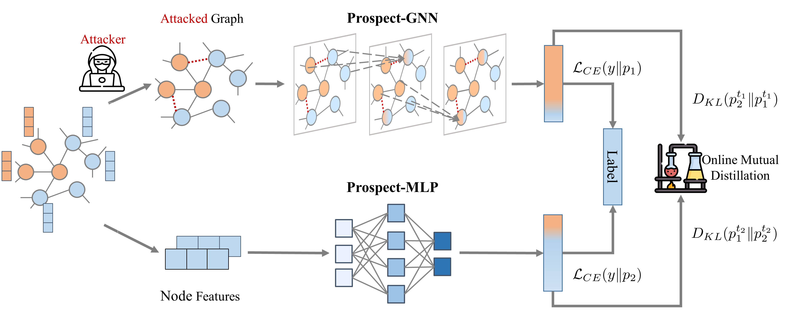

# PROSPECT: Learn MLPs Robust against Graph Adversarial Structure Attacks

## Table of Contents

+ [About](#about)
+ [Getting Started](#getting_started)
+ [Usage](#usage)
+ [Contributing](#contributing)

## About

PROSPECT is the FIRST ONLINE graph distillation multi-layer perceptron (GD-MLP) framework PROSPECT, which learns GNNs
and ML**P**s **RO**bust again**S**t gra**P**h adv**E**rsarial stru**C**ture at**T**acks.

In PROSPECT, an MLP and a GNN collaboratively learn by mutual distillation, as depicted by the following figure.


The highlights of PROSPECT have three aspects: 1) (provable) structure adversarial robustness, 2) adaptability to heterophilous graphs
, and 3) the inference scalability. A rough comparison between PROSPECT and previous related works is shown by
the table below, where 1-3 stars means low,  medium, and high scores. Please refer to the paper for more details and discussion.

|                              | Evasion structure robustness | Poi. structure robustness | Adaptability to heterophily | Inference scalability |
| ---------------------------- | ---------------------------- | ------------------------- | --------------------------- | --------------------- |
| Purification-based defenders | ⭐️                            | ⭐️  ⭐️                      | ⭐️                           | ⭐️                     |
| EvenNet                      | ⭐️  ⭐️                         | ⭐️  ⭐️                      | ⭐️   ⭐️                       | ⭐️                     |
| GLNN                         | ⭐️    ⭐️                       | ⭐️  ⭐️                      | ⭐️   ⭐️                       | ⭐️   ⭐️   ⭐️             |
| PROSPECT                     | ⭐️   ⭐️   ⭐️                    | ⭐️  ⭐️   ⭐️                  | ⭐️   ⭐️   ⭐️                   | ⭐️   ⭐️   ⭐️             |

## Getting_Started

These instructions will get you a copy of the project up and running on your local machine for development and testing
purposes. We test the code with RTX4090 and CUDA11.8.

### Prerequisites

The python packages used are list in `requirements.txt`

```
# --------- pytorch --------- #
torch==2.0.1
torchvision==0.9.0
lightning==2.0.6
torchmetrics==1.0.2

# --------- pytorch geometric--------- #
torch-sparse==0.6.15
torch-cluster==1.6.1
torch-scatter== 2.1.1
torch-geometric== 2.3.1
ogb==1.3.6

# --------- hydra --------- #
hydra-core==1.3.2
hydra-colorlog==1.2.0

# --------- loggers --------- #
wandb
tensorboard

# --------- others --------- #
jsonargparse==4.24.1    # cli parameter management
rootutils==1.0.7        # standardizing the project root setup
```

### Installing

Just unzip the compressed `atk_data.zip` to `atk_data` folder, and run `prospect_main.py` under the
project directory.

## Usage

We provide part of experiment config files (under `exp_configs`)
during the review period and the full config files for all datasets will be
released as soon as the paper is accepted.

You can run the following commands in a terminal to get some results.

```shell
python prospect_main.py --config exp_configs/polblogs_metattack_0.15_clean=0_itr=0.0++gnn=sage_hid=64.yaml
python prospect_main.py --config exp_configs/cora_metattack_0.15_clean=0_itr=0.0++gnn=sage_hid=64.yaml
python prospect_main.py --config exp_configs/uai_metattack_0.15_clean=0_itr=0.0++gnn=sage_hid=64.yaml
python prospect_main.py --config exp_configs/texas_metattack_0.2_clean=0_itr=0.0++gnn=sage_hid=64.yaml
```

## Contributing

As stated in the appendix of our paper, to facilitate future research on GD-MLPs,
we have designed some LightningModules to eliminate boilerplate code so that researchers
can focus on designing their distillation modules.
These LightningModules support

1) offline, online, and hybrid distillation;
2) multiple teachers and/or multiple students;
3) plug-in (customized) feature and/or logit distillation strategy modules;
4) mini-batch sampling or full-batch training and distillation;
5) unified and friendly data interfaces for both clean and attacked graph data;
6) easy switch between transductive, inductive and semi-inductive evaluation settings;
7) easy switch between poisoning and evasion attack evaluation settings;
8) flexible experiment monitoring and management. Once the paper is accepted, we will release our preattacked datasets, library code, experiment code, and hyperparameters.

Now this repo is ready to implement many GD-MLP frameworks. We are welcome to the pull requests of
your exciting distillation modules! 🍻

## Credits

Thank PyTorch, PyG, and Lightning teams for their efforts to build research-friendly frameworks.
Also thank @asheve for the inspiration from their template https://github.com/ashleve/lightning-hydra-template.
